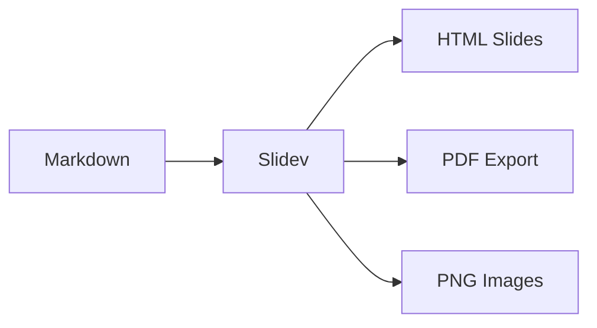

# Welcome to Slidev

Presentation Slides for Developers

<div class="abs-br m-6 text-sm opacity-50">
  Press Space to navigate →
</div>

---
layout: center
---

# What is Slidev?

Slidev is a slides maker and presenter designed for developers.

It allows you to create beautiful slides with **Markdown** and **Vue components**.

---

# Features

<v-clicks>

- 📝 **Markdown-based** - Focus on content, style it later
- 🎨 **Themeable** - Share and reuse themes via npm
- 🧑‍💻 **Developer Friendly** - Built-in code highlighting, live coding
- 🤹 **Interactive** - Embed Vue components directly
- 📤 **Exportable** - PDF, PNG, or host as SPA
- 🛠 **Hackable** - Full control over Vite, Vue, UnoCSS

</v-clicks>

---
layout: two-cols
---

# Code Example

Show your code with syntax highlighting:

```python {all|1|3-5|all}
def fibonacci(n):
    """Generate Fibonacci sequence"""
    a, b = 0, 1
    for _ in range(n):
        yield a
        a, b = b, a + b
```

::right::

# Output

<v-click>

```
0, 1, 1, 2, 3, 5, 8, 13, 21, 34
```

</v-click>

<v-click>

Step through code with `{all|1|3-5|all}` syntax

</v-click>

---
layout: center
class: text-center
---

# Diagrams



---

# Math Equations

Inline math: $E = mc^2$

Block equations:

$$
\int_{-\infty}^{\infty} e^{-x^2} dx = \sqrt{\pi}
$$

$$
\nabla \cdot \mathbf{E} = \frac{\rho}{\varepsilon_0}
$$

---
layout: quote
---

# "The best way to predict the future is to invent it."

— Alan Kay

---
layout: end
class: text-center
---

# Thank You!

[Documentation](https://sli.dev) · [GitHub](https://github.com/slidevjs/slidev)

<!-- 
Presenter notes: 
- Ask for questions
- Share the GitHub link for those interested
-->
