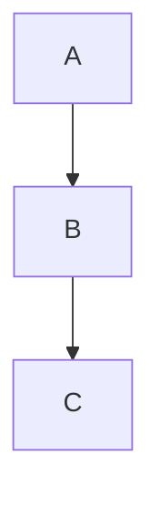
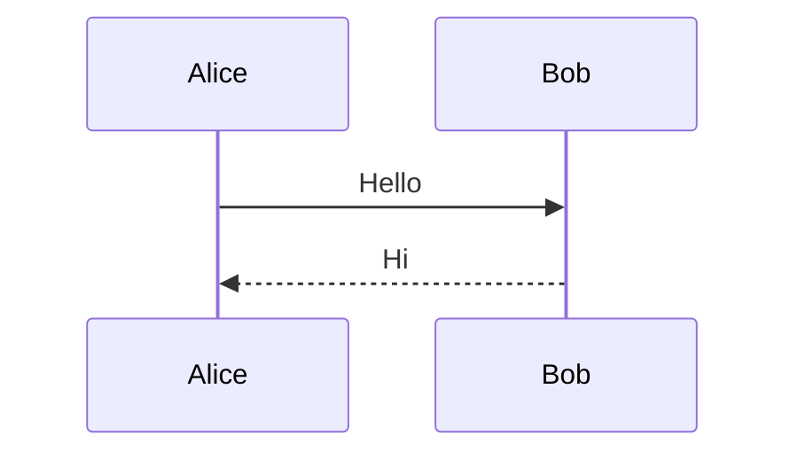
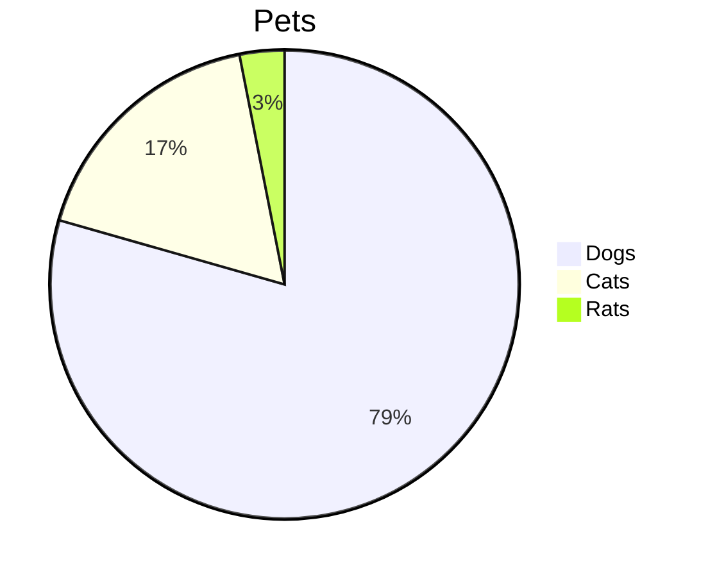
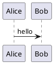

# Slidev Syntax Reference

## Slide Structure

### Separators

```markdown
# Slide 1

---

# Slide 2
```

### Frontmatter

First slide (headmatter) configures entire deck:

```yaml
---
theme: seriph
title: My Presentation
transition: slide-left
mdc: true
---
```

Per-slide frontmatter:

```yaml
---
layout: center
background: /image.jpg
class: text-white
---
```

## Content Features

### Code Blocks

Basic:
```markdown
```python
print("Hello")
```
```

Line highlighting:
```markdown
```ts {2,3}
const a = 1
const b = 2  // highlighted
const c = 3  // highlighted
```
```

Click-through:
```markdown
```ts {all|1|2-3|all}
const a = 1
const b = 2
const c = 3
```
```

Line numbers:
```markdown
```ts {1|2|3} {lines:true, startLine:5}
```
```

### LaTeX

Inline: `$E = mc^2$`

Block:
```markdown
$$
\int_0^\infty e^{-x^2} dx = \frac{\sqrt{\pi}}{2}
$$
```

### Mermaid Diagrams

```markdown

```

```markdown

```

```markdown

```

### PlantUML

```markdown

```

## Animations

### v-click

Reveal elements sequentially:

```markdown
<v-click>

This appears on click

</v-click>
```

### v-clicks

Auto-wrap list items:

```markdown
<v-clicks>

- Item 1
- Item 2
- Item 3

</v-clicks>
```

### Click ranges

```markdown
<v-click at="2">Appears at step 2</v-click>
<v-click at="[3,5]">Visible at steps 3-5</v-click>
```

## Presenter Notes

Add HTML comment at end of slide:

```markdown
# Slide Content

<!--
These are presenter notes.
- Bullet points work
- Only visible in presenter mode (press p)
-->
```

## Styling

### UnoCSS Classes

```markdown
<div class="text-3xl text-center font-bold text-blue-500">
  Styled content
</div>
```

### Scoped CSS

```markdown
<style>
h1 {
  color: red;
}
</style>
```

### MDC Syntax

```markdown
This has **bold**{.text-red-500} text.
```

## Special Components

### Tweet

```markdown
<Tweet id="1390115482657726468" />
```

### YouTube

```markdown
<Youtube id="dQw4w9WgXcQ" />
```

### Arrow

```markdown
<Arrow x1="10" y1="10" x2="100" y2="100" />
```

## Headmatter Options

| Option | Description | Default |
|--------|-------------|---------|
| `theme` | Theme name | `default` |
| `title` | Presentation title | — |
| `transition` | Slide transition | `slide-left` |
| `mdc` | Enable MDC syntax | `false` |
| `highlighter` | Code highlighter | `shiki` |
| `colorSchema` | Color scheme | `auto` |
| `aspectRatio` | Slide ratio | `16/9` |
| `canvasWidth` | Canvas width | `980` |

## Frontmatter Options

| Option | Description |
|--------|-------------|
| `layout` | Layout name |
| `background` | Background image path |
| `class` | CSS classes |
| `transition` | Override transition |
| `clicks` | Manual click count |
